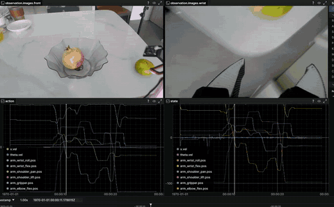

**English** | [中文](README.zh-CN.md)

# lerobot_android

Use an idle phone as the computer on a robot, in place of the Raspberry Pi on LeKiwi and other mobile bases. It teleoperates a single-arm XLeRobot, drives the wheels from the keyboard, and records a LeRobot dataset. The phone runs the follower bus and the cameras. A PC runs the leader arm and `lerobot-teleoperate` / `lerobot-record`. The end goal is to run policy inference on the phone. The demo here was made with XLeRobot 0.4.0.


The phone sits on the robot and shows the eyes. The follower serial adapter and the wrist camera plug into the phone. The PC records the front camera, the wrist camera, the arm, and the base together:




## What it does

- Teleoperate one arm from an SO-101 leader on the PC.
- Drive the differential-drive base from the keyboard while the arm follows the leader.
- Record one episode: joint positions, `x.vel`, `theta.vel`, and the phone cameras, in the normal LeRobot dataset format. Recording at 720p and 30 fps works now, using two USB cameras.

## How it works

The phone app owns the follower USB serial port. A 30 Hz loop on the phone reads the servos and writes the latest goal, the same pattern as a LeKiwi host. The PC does not wait for a Wi-Fi round trip inside that servo tick. It talks to the phone with `host://<phone-ip>` (commands on port 9101, state on port 9102). Cameras are MJPEG over HTTP on port 8080. The leader arm stays on the PC.

The phone encodes each camera frame as JPEG and streams MJPEG, instead of sending raw pixels. The PC reads that stream in the background and the control loop uses only the newest frame, so a late frame does not stall the 30 Hz arm loop. The socket timeout is 15 seconds because the first open of a USB camera takes a few seconds.

Putting the serial link on the PC means every tick reads and writes across Wi-Fi. Each tick waits for a round trip, and the loop falls below 30 Hz. The read and write now stay on the phone, next to USB. The PC only exchanges the newest goal and the newest state, so Wi-Fi delay sits outside the servo period.

`lerobot/` is the [Hugging Face LeRobot](https://github.com/huggingface/lerobot) tree at tag **v0.6.1** (commit `7e241bd63`), plus the XLeRobot robot, the phone host client, and an MJPEG camera. Dependencies match the upstream `pyproject.toml`. Python **3.12** is required. This folder does not include the upstream Git history. `android/` is the phone app.

A debug APK is in [`release/lerobot-android-debug.apk`](release/lerobot-android-debug.apk).

## Why a phone

1. The phone already has a screen, cameras, an NPU, an IMU, GNSS, 5G, Wi-Fi, and a compass. Those parts do not have to be bought and wired one by one.
2. Those sensors are not published yet. See the list below.

## To do

- [ ] ROS 2: publish the cameras, joint state, and base velocity.

## 1. Computer

```bash
conda create -n lerobot python=3.12 -y
conda activate lerobot
pip install -e "lerobot[feetech]"
```

`lerobot[feetech]` is the same hardware extra upstream uses for Feetech STS servos. The rest of the environment matches the official package.

## 2. Phone

Build and install `android/` (JDK 17). On the phone, turn on OTG, allow camera, notification, and USB permission, then start the foreground bridge service. If the camera and the serial adapter share one OTG port, use a USB hub.

The follower arm's USB serial adapter plugs into the phone. The first serial port is driven on the phone (command port 9101, state port 9102). Extra serial adapters stay raw TCP from port 9000. The leader arm plugs into the computer, not the phone.

The phone and the computer must be on the same LAN. The app shows the phone IP. Open `http://<phone-ip>:8080/info.json` and copy the camera URLs from there. `width`, `height`, and `fps` are required on every camera. `warmup_s: 10` covers a slow first open of a USB camera.

## 3. Calibrate once

`host://` cannot run interactive calibration. Plug the follower into the computer once, calibrate it, then move that USB adapter back to the phone. Use the same `--robot.id` afterwards. On this computer the leader is `/dev/ttyACM1`. The follower calibration id is `xlerobot_single`; change the port to the device node it gets while plugged into the computer.

```bash
lerobot-calibrate \
  --teleop.type=so101_leader \
  --teleop.port=/dev/ttyACM1 \
  --teleop.id=7vw_leader_arm

lerobot-calibrate \
  --robot.type=xlerobot \
  --robot.port=/dev/ttyACM0 \
  --robot.id=xlerobot_single
```

## 4. Teleoperate one arm

Keep this terminal focused. `i` / `k` drive forward and back, `u` / `o` turn left and right, `n` / `m` raise and lower speed. The phone IP below is the one shown in the app, `192.168.124.10`.

```bash
conda activate lerobot
lerobot-teleoperate \
  --robot.type=xlerobot \
  --robot.port=host://192.168.124.10 \
  --robot.id=xlerobot_single \
  --teleop.type=so101_leader \
  --teleop.port=/dev/ttyACM1 \
  --teleop.id=7vw_leader_arm
```

## 5. Record one episode

During recording, `n` raises speed and does not end the episode. Right arrow ends the episode early, `r` or Left re-records, `q` quits. The front camera is the phone's built-in camera. The wrist camera is the USB camera. Both are 1280×720 at 30 fps.

```bash
conda activate lerobot
lerobot-record \
  --robot.type=xlerobot \
  --robot.port=host://192.168.124.10 \
  --robot.id=xlerobot_single \
  --teleop.type=so101_leader \
  --teleop.port=/dev/ttyACM1 \
  --teleop.id=7vw_leader_arm \
  --play_sounds=false \
  --robot.cameras="{ front: {type: mjpeg, url: http://192.168.124.10:8080/cam/front/mjpeg, width: 1280, height: 720, fps: 30, warmup_s: 10}, wrist: {type: mjpeg, url: http://192.168.124.10:8080/uvc/2004/mjpeg, width: 1280, height: 720, fps: 30, warmup_s: 10} }" \
  --dataset.repo_id=local/xlerobot_host_1ep \
  --dataset.root=/home/fishros/workspace/ai/apps/lerobot_data/local/xlerobot_host_1ep \
  --dataset.single_task="teleop demo" \
  --dataset.num_episodes=1 \
  --dataset.episode_time_s=30 \
  --dataset.reset_time_s=5 \
  --dataset.push_to_hub=false \
  --dataset.streaming_encoding=true \
  --dataset.encoder_threads=2
```

```bash
lerobot-dataset-viz \
  --repo-id local/xlerobot_host_1ep \
  --root /home/fishros/workspace/ai/apps/lerobot_data/local/xlerobot_host_1ep \
  --episode-index 0 \
  --display-compressed-images
```

## License

This repository is under the [Apache License 2.0](LICENSE). `lerobot/` keeps the upstream Hugging Face copyright notices, also Apache 2.0.
