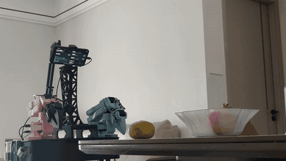
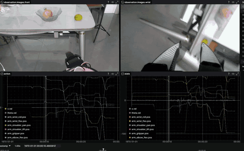

[English](README.md) | **中文**

# lerobot_android

手机不需要 root，装上就能直接用。用手机自带的前置相机，把 USB 相机和舵机控制板接到手机的 USB OTG 上，就可以控制移动机器人。



手机装在机器人上，屏幕显示眼睛。从臂串口和腕部摄像头插在手机上。电脑把前置相机、腕部相机、手臂和底盘录在一起：



## 这个项目能做什么

- 用电脑上的 SO-101 主臂遥操一条从臂。
- 手臂跟着主臂的同时，用键盘开差速底盘。
- 录一集数据：关节、`x.vel`、`theta.vel` 和手机摄像头，格式就是普通的 LeRobot 数据集。目前可以 720p、30 fps 录制，用两路 USB 摄像头。

## 怎么做的

手机 App 占着从臂的 USB 串口。手机上有一个 30 Hz 循环读舵机、写下最新目标，做法和 LeKiwi 的主机一样。电脑的舵机节拍里不再等一次 Wi-Fi 来回。电脑用 `host://<手机IP>` 连接手机（命令端口 9101，状态端口 9102）。摄像头是 8080 端口上的 MJPEG。主臂留在电脑上。

摄像头在手机上编成 JPEG，按 MJPEG 推流，不传原始像素。电脑在后台收流，控制循环只用最新一帧，所以某一帧来得慢也不会拖住 30 Hz 的手臂。第一次打开 USB 摄像头要几秒，套接字超时留到 15 秒。

串口如果放在电脑上、每拍都经 Wi-Fi 读一次再写一次，一拍就要等一个来回，循环会掉到 30 Hz 以下。现在读写留在手机上、紧挨着 USB。电脑只交换最新的目标和最新的状态，Wi-Fi 延迟不进舵机周期。

`lerobot/` 基于官方 [LeRobot](https://github.com/huggingface/lerobot) tag **v0.6.1**（提交 `7e241bd63`），并加上了 XLeRobot、手机主机客户端和 MJPEG 相机。依赖与官方 `pyproject.toml` 相同，需要 **Python 3.12**。这个目录不带官方 Git 历史。`android/` 是手机端。

调试 APK 在 [`release/lerobot-android-debug.apk`](release/lerobot-android-debug.apk)。

## 为什么用手机

1. 手机自带高性能屏幕、摄像头、NPU、IMU、GNSS、5G、Wi-Fi 和指南针。这些不用再单独买、单独接线。
2. 这些传感器现在还没有对外发布。见下面的待办。

## 待办

- [ ] 支持 ROS 2：发布摄像头、关节状态和底盘速度。

## 1. 电脑

```bash
conda create -n lerobot python=3.12 -y
conda activate lerobot
pip install -e "lerobot[feetech]"
```

`lerobot[feetech]` 是官方给飞特 STS 舵机用的硬件扩展，其余环境和官方包一致。

## 2. 手机

用 JDK 17 编译并安装 `android/`。手机打开 OTG，允许相机、通知和 USB 权限，然后打开后台转发服务。摄像头和串口共用一个 OTG 口时，用 USB Hub。

从臂的 USB 串口插在手机上。第一路串口由手机驱动（命令端口 9101，状态端口 9102）。多出来的串口仍是从 9000 起的原始 TCP。主臂插在电脑上，不插手机。

手机和电脑要在同一个局域网。App 上能看到手机 IP。打开 `http://<手机IP>:8080/info.json`，用里面的摄像头地址。每路相机都必须写 `width`、`height`、`fps`。`warmup_s: 10` 是为了盖住 USB 摄像头第一次打开较慢的情况。

## 3. 先标定一次

`host://` 不能做交互式标定。把从臂插到电脑上标定一次，再把这个 USB 转接插回手机。之后继续用同一个 `--robot.id`。`<主臂串口>` 是主臂在电脑上的设备，例如 `/dev/ttyACM0`。从臂标定用它插在电脑上时的串口。

```bash
lerobot-calibrate \
  --teleop.type=so101_leader \
  --teleop.port=<主臂串口> \
  --teleop.id=<主臂标定名>

lerobot-calibrate \
  --robot.type=xlerobot \
  --robot.port=<从臂在电脑上的串口> \
  --robot.id=<机器人标定名>
```

例如：

```bash
lerobot-calibrate \
  --teleop.type=so101_leader \
  --teleop.port=/dev/ttyACM1 \
  --teleop.id=7vw_leader_arm

lerobot-calibrate \
  --robot.type=xlerobot \
  --robot.port=/dev/ttyACM0 \
  --robot.id=xlerobot_single
```

## 4. 单臂遥操

焦点留在这个终端。`i` / `k` 前进后退，`u` / `o` 左右转，`n` / `m` 加减速度。`<手机IP>` 用 App 上看到的地址。

```bash
conda activate lerobot
lerobot-teleoperate \
  --robot.type=xlerobot \
  --robot.port=host://<手机IP> \
  --robot.id=<机器人标定名> \
  --teleop.type=so101_leader \
  --teleop.port=<主臂串口> \
  --teleop.id=<主臂标定名>
```

例如：

```bash
conda activate lerobot
lerobot-teleoperate \
  --robot.type=xlerobot \
  --robot.port=host://192.168.124.10 \
  --robot.id=xlerobot_single \
  --teleop.type=so101_leader \
  --teleop.port=/dev/ttyACM1 \
  --teleop.id=7vw_leader_arm
```

## 5. 录制一集

录制时 `n` 是加速，不用来结束本集。右方向键提前结束，`r` 或左方向键重录，`q` 退出。两路相机都写 1280×720、30 fps。腕部地址换成 `info.json` 里的 UVC 项。

```bash
conda activate lerobot
lerobot-record \
  --robot.type=xlerobot \
  --robot.port=host://<手机IP> \
  --robot.id=<机器人标定名> \
  --teleop.type=so101_leader \
  --teleop.port=<主臂串口> \
  --teleop.id=<主臂标定名> \
  --play_sounds=false \
  --robot.cameras="{ front: {type: mjpeg, url: http://<手机IP>:8080/cam/front/mjpeg, width: 1280, height: 720, fps: 30, warmup_s: 10}, wrist: {type: mjpeg, url: http://<手机IP>:8080/uvc/<UVC设备号>/mjpeg, width: 1280, height: 720, fps: 30, warmup_s: 10} }" \
  --dataset.repo_id=local/xlerobot_1ep \
  --dataset.root=<数据集目录> \
  --dataset.single_task="teleop demo" \
  --dataset.num_episodes=1 \
  --dataset.episode_time_s=30 \
  --dataset.reset_time_s=5 \
  --dataset.push_to_hub=false \
  --dataset.streaming_encoding=true \
  --dataset.encoder_threads=2
```

例如：

```bash
conda activate lerobot
lerobot-record \
  --robot.type=xlerobot \
  --robot.port=host://192.168.124.10 \
  --robot.id=xlerobot_single \
  --teleop.type=so101_leader \
  --teleop.port=/dev/ttyACM1 \
  --teleop.id=7vw_leader_arm \
  --play_sounds=false \
  --robot.cameras="{ front: {type: mjpeg, url: http://192.168.124.10:8080/cam/front/mjpeg, width: 1280, height: 720, fps: 30, warmup_s: 10}, wrist: {type: mjpeg, url: http://192.168.124.10:8080/uvc/2004/mjpeg, width: 1280, height: 720, fps: 30, warmup_s: 10} }" \
  --dataset.repo_id=local/xlerobot_host_1ep \
  --dataset.root=/home/fishros/workspace/ai/apps/lerobot_data/local/xlerobot_host_1ep \
  --dataset.single_task="teleop demo" \
  --dataset.num_episodes=1 \
  --dataset.episode_time_s=30 \
  --dataset.reset_time_s=5 \
  --dataset.push_to_hub=false \
  --dataset.streaming_encoding=true \
  --dataset.encoder_threads=2
```

```bash
lerobot-dataset-viz \
  --repo-id local/xlerobot_1ep \
  --root <数据集目录> \
  --episode-index 0 \
  --display-compressed-images
```

例如：

```bash
lerobot-dataset-viz \
  --repo-id local/xlerobot_host_1ep \
  --root /home/fishros/workspace/ai/apps/lerobot_data/local/xlerobot_host_1ep \
  --episode-index 0 \
  --display-compressed-images
```

## 协议

本仓库使用 [Apache License 2.0](LICENSE)。`lerobot/` 仍保留上游 Hugging Face 的版权声明，同样是 Apache 2.0。
